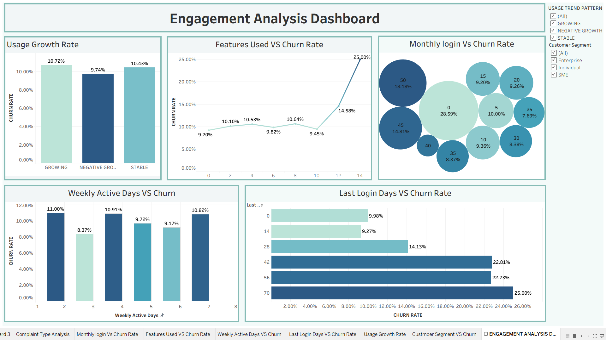
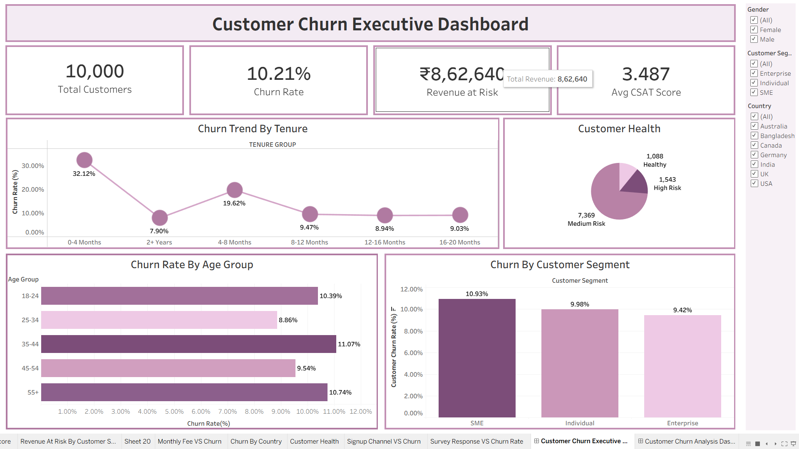
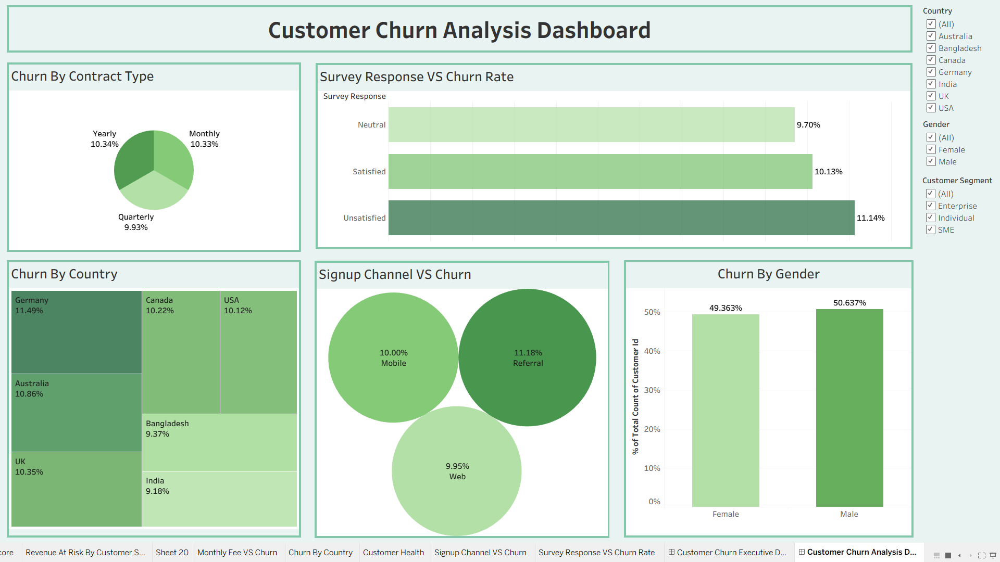
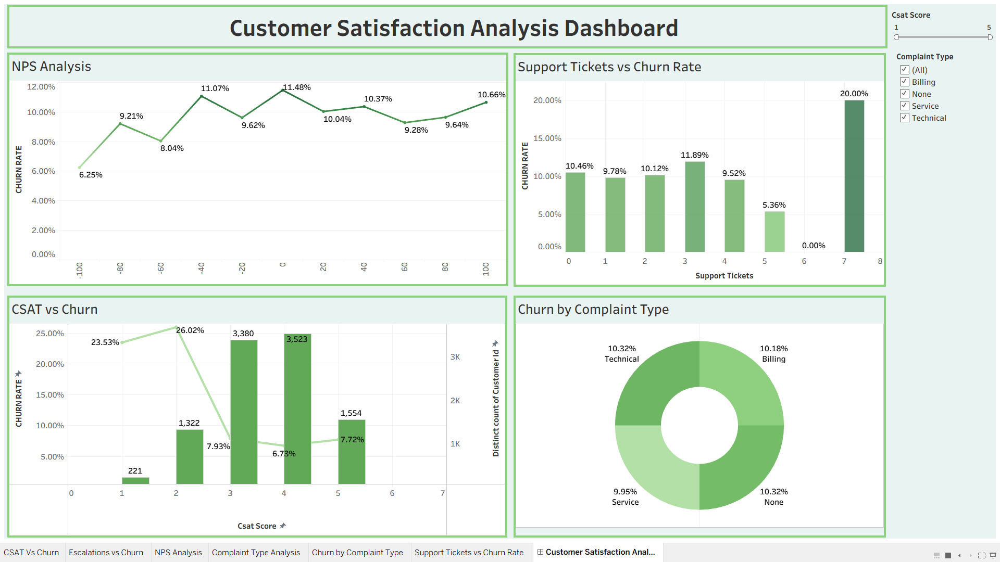
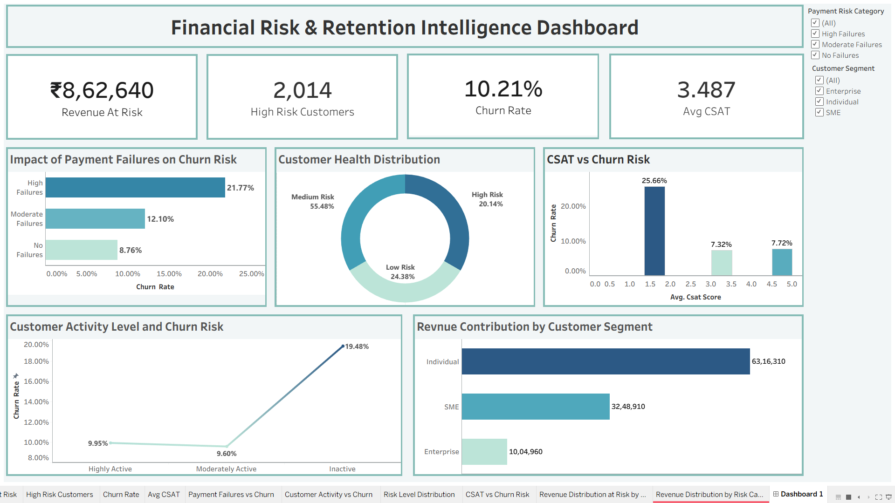

# Customer Churn Risk Intelligence Dashboard

## Project Overview

This project focuses on customer churn prediction, retention analytics, customer satisfaction analysis, engagement monitoring, and financial risk assessment using Tableau.

The objective is to identify customers with a high probability of churn, understand the factors driving churn behavior, and estimate the revenue exposure associated with customer loss.

---

## Business Problem

Customer churn directly impacts revenue growth and profitability.

The business required a data-driven solution to:

- Identify high-risk customers
- Analyze churn drivers
- Measure customer satisfaction
- Monitor customer engagement
- Estimate revenue at risk
- Support proactive retention strategies

---

## Tools & Technologies

- Tableau
- Microsoft Excel
- Data Modeling
- KPI Design
- Business Intelligence
- Data Visualization
- Customer Analytics

---

## Key KPIs

| KPI | Value |
|------|---------|
| Total Customers | 10,000 |
| Churn Rate | 10.21% |
| Revenue At Risk | ₹8,62,640 |
| High Risk Customers | 2,014 |
| Average CSAT | 3.487 |

---

# Dashboard 1: Customer Churn Executive Dashboard

### Insights

- Early-tenure customers show significantly higher churn.
- SME customers have the highest churn rate.
- Medium-risk customers represent the largest customer segment.
- Customer satisfaction remains moderate with scope for improvement.

---

# Dashboard 2: Customer Churn Analysis Dashboard

### Insights

- Unsatisfied customers exhibit the highest churn rates.
- Referral signup channels experience higher churn than Web and Mobile channels.
- Churn varies across countries and customer demographics.
- Contract type influences customer retention behavior.

---

# Dashboard 3: Customer Satisfaction Analysis Dashboard

### Insights

- Lower CSAT scores strongly correlate with higher churn rates.
- Increased support tickets are associated with elevated churn risk.
- Customer complaints provide valuable indicators of churn behavior.
- NPS trends highlight customer sentiment patterns.

---

# Dashboard 4: Engagement Analysis Dashboard

### Insights

- Inactive customers have significantly higher churn rates.
- Long gaps since the last login increase churn probability.
- Customers using more platform features tend to show stronger engagement.
- Usage behavior serves as an early churn indicator.

---

# Dashboard 5: Financial Risk & Retention Intelligence Dashboard

### Insights

- High payment failures significantly increase churn risk.
- More than ₹8.6 lakh of revenue is exposed to churn risk.
- Individual customers contribute the largest revenue share.
- High-risk customers require immediate retention intervention.

---

## Business Recommendations

1. Develop proactive retention campaigns for high-risk customers.
2. Improve payment recovery mechanisms to reduce payment-related churn.
3. Enhance customer support processes to improve CSAT scores.
4. Launch re-engagement campaigns for inactive customers.
5. Prioritize retention efforts for high-value customer segments.

---

## Skills Demonstrated

- KPI Development
- Business Analytics
- Customer Segmentation
- Churn Analysis
- Revenue Risk Analysis
- Tableau Dashboard Design
- Data Storytelling
- Data Visualization
